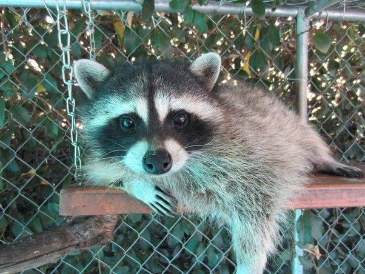

# keras-yolo3

## Introduction

A keras implementation of YOLOv3 (Tensorflow backend) for raccoon detection (ref: [qqwweee/keras-yolo3](https://github.com/qqwweee/keras-yolo3))


## Raccoon dataset

Raccoon dataset is avaiable here: [Raccoon dataset](https://github.com/bing0037/Raccoon_dataset) (modified from [experiencor/raccoon_dataset](https://github.com/experiencor/raccoon_dataset))



## How to use:

### 1) Get the model

Step 1: Download the project:
```
git clone https://github.com/pournima108/Custom_object_retrain_yolov3_keras.git
```

Step 2: Download YOLOv3 weights from [YOLO website](http://pjreddie.com/darknet/yolo/) or [yolov3.weights](https://drive.google.com/uc?id=1owAyOwfpwxpbs0BLWPkwT0srRUTpFHIn&export=download).

Step 3: Convert the Darknet YOLO model to a Keras model 
```
python convert.py yolov3.cfg yolov3.weights model_data/yolo.h5	# to get yolo.h5(model)
```

**OR** download the model [yolo.h5](https://drive.google.com/uc?export=download&confirm=8R0l&id=1Dd-uUhhXvosXiIIZM8tiXoZyENJxIY4u) to *model_data/* directory directly.

### 2) Test the model on coco dataset(original yolo model is trained on coco dataset)
Run YOLO detecion.
```
python yolo_video.py --model_path model_data/yolo.h5 --classes_path model_data/coco_classes.txt --image
```

### 3) Retrain the model for helmet detection:
Step 1: Download Raccoon dataset to root directory
```
git clone https://github.com/pournima108/helmet_dataset.git
```
Step 2: Parse annotation:
```
python helmet_annotation.py
```
Step 3: Download YOLOv3 weights from [yolo_weights](https://drive.google.com/uc?export=download&confirm=-b_7&id=1HlydiovCtnUJabQvZIbx77v6sE4OXrac) to *model_data/* directory

Step 4: Retrain the model(use yolo.h5 as the pretrained model) 
```
python train.py -a helmet_folder/helmet_train_data.txt -c helmet_folder/helmet_classes.txt -o model_data/helmet_derived_model.h5
```


Step 5: Run the model
```
python yolo_video.py --image
```

